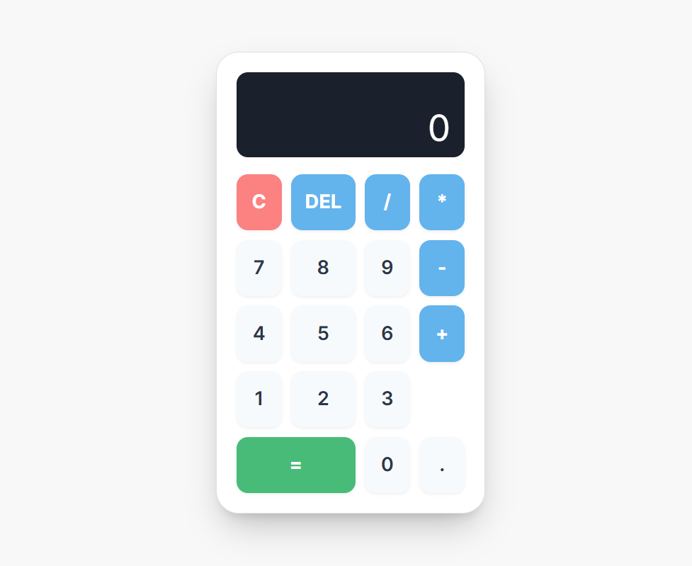
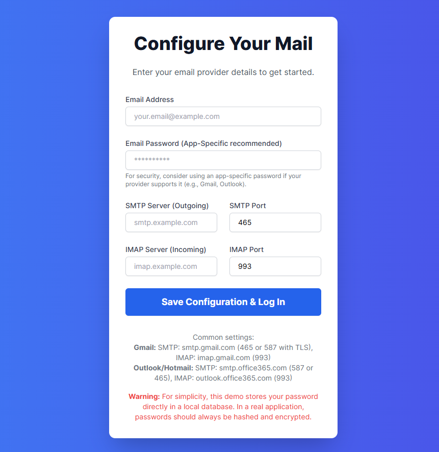
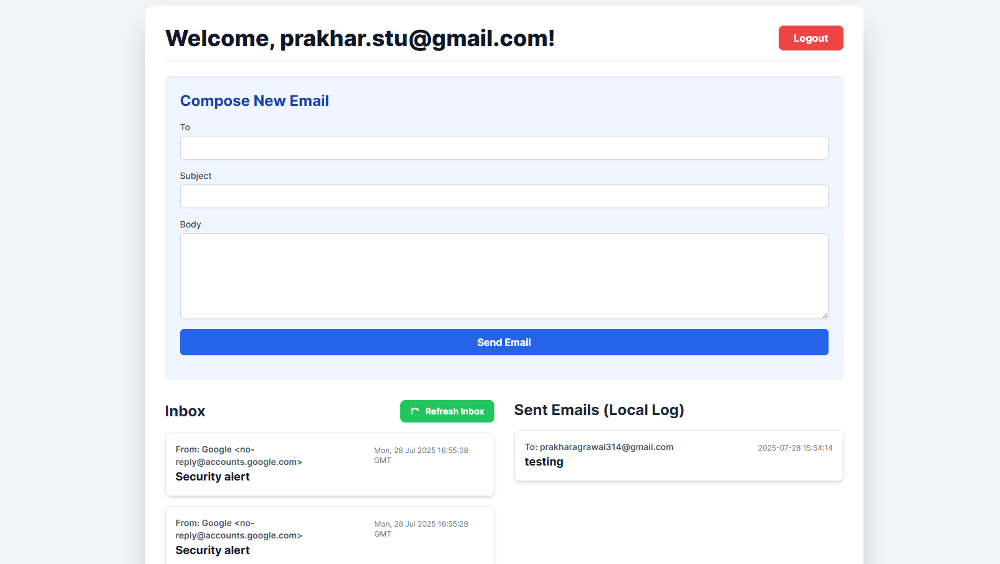
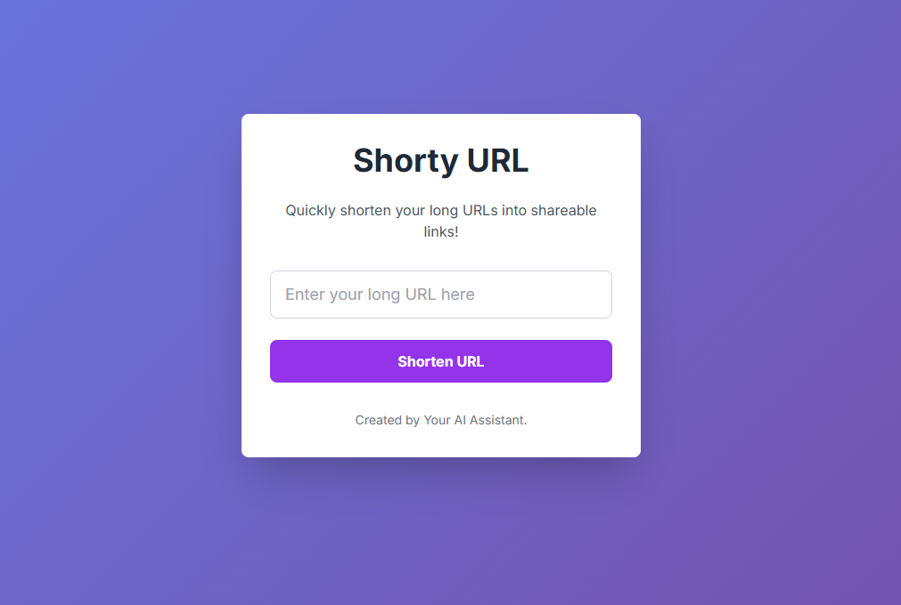
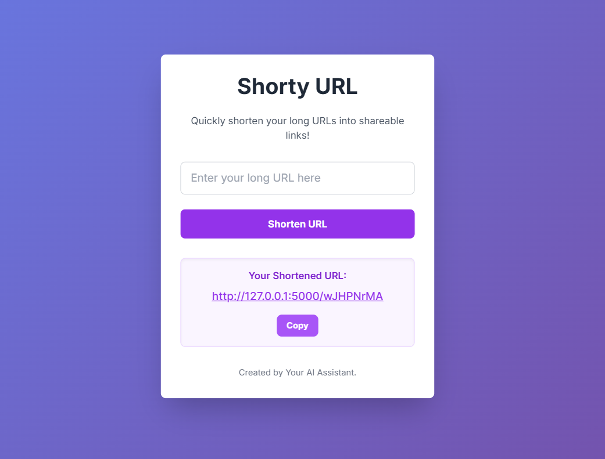

# CodeClause Internship Projects 🚀

Welcome to my **CodeClause Internship Projects** repository! This collection showcases a series of web development applications built as part of my internship, demonstrating proficiency in **Python (Flask)**, front-end technologies (**HTML, CSS with Tailwind CSS**), and **JavaScript**.

Each project is designed to be functional, user-friendly, and **provide** practical experience with common web development patterns.

---

## 📋 Table of Contents

1. [Stylish Calculator App 🔢](#1-stylish-calculator-app-)
2. [Real-Time Mail Application 📧📬](#2-real-time-mail-application-)
3. [URL Shortener 🔗✨](#3-url-shortener-)
4. [Technologies Used 🛠️](#4-technologies-used-)
5. [Setup and Installation ⚙️⬇️](#5-setup-and-installation-)
6. [Usage ▶️](#6-usage-)
7. [Screenshots 📸](#7-screenshots-)
8. [Contributing 🤝](#8-contributing-)
9. [License 📄](#9-license-)
10. [Contact ✉️](#10-contact-)

---

## 1. Stylish Calculator App ➕➖✖️➗🔢

A modern and interactive web-based calculator that handles basic arithmetic operations. Designed for a clean user experience with a responsive layout.

### ✨ Features:

* ✅ **Basic Operations:** Addition, subtraction, multiplication, and division.
* 💡 **Real-time Display:** Shows both the current input/result and the ongoing operation history.
* 🗑️ **Clear & Delete:** Buttons for clearing the entire input or deleting the last character.
* ⌨️ **Keyboard Support:** Fully functional with keyboard input.
* 📱 **Responsive Design:** Adapts seamlessly to different screen sizes.

### 💻 Technologies:

* 🐍 **Backend:** Python (Flask)
* 🌐 **Frontend:** HTML, JavaScript
* 🎨 **Styling:** Tailwind CSS

---

## 2. Real-Time Mail Application 📧📬

A simple web-based email client allowing users to configure their email settings (SMTP/IMAP), send new emails, and view incoming messages from their inbox. It also logs sent emails locally.

### ✨ Features:

* ⚙️ **Email Configuration:** Set up SMTP and IMAP server details, email address, and password.
* ✍️ **Send Emails:** Compose and send emails with recipients, subjects, and body content.
* 📥 **Inbox Viewing:** Fetches and displays the latest emails from your inbox.
* 📤 **Sent Emails Log:** Maintains a local log of emails you've sent.
* ↩️ **Reply Functionality:** Quickly populate the compose form to reply to received or sent emails.
* 🔄 **Dynamic Inbox Refresh:** Refresh your inbox with a click.

### ⚠️ Important Security Note:

For demonstration purposes, this application stores email passwords directly in a local SQLite database. **In a real-world production environment, passwords must ALWAYS be securely hashed and encrypted.** Using **app-specific passwords** from your email provider (e.g., Gmail App Passwords) is highly recommended for added security, even for testing.

### 💻 Technologies:

* 🐍 **Backend:** Python (Flask, `smtplib`, `imaplib`, `email` modules)
* 📄 **Database:** SQLite3 (for user configurations and sent email logs)
* 🌐 **Frontend:** HTML, JavaScript
* 🎨 **Styling:** Tailwind CSS

---

## 3. URL Shortener 🔗✨

A lightweight web service that transforms long, unwieldy URLs into concise, easy-to-share short links.

### ✨ Features:

* ✂️ **URL Shortening:** Generates a unique short code for any given long URL.
* ➡️ **Redirection:** Short URLs redirect seamlessly to their original long counterparts.
* 📋 **Copy to Clipboard:** Convenient button to copy the generated short URL.
* ⛔ **Error Handling:** Displays a user-friendly error page for invalid or non-existent short URLs.

### ⚠️ Important Data Storage Note:

This demo uses an in-memory dictionary (`url_mappings`) to store URL mappings. This means all shortened URLs will be lost when the Flask server is restarted.
**For production use, consider persistent storage (SQLite, PostgreSQL, MongoDB, etc).**

### 💻 Technologies:

* 🐍 **Backend:** Python (Flask, `secrets` module)
* 🌐 **Frontend:** HTML, JavaScript
* 🎨 **Styling:** Tailwind CSS

---

## 4. Technologies Used 🛠️

This repository leverages the following core technologies:

* 🐍 **Python 3.x:** The primary programming language.
* 🍾 **Flask:** A lightweight Python web framework.
* 📄 **HTML5:** For structuring web content.
* 🌈 **CSS3:** Tailwind CSS for styling.
* ⚙️ **JavaScript:** Interactive front-end logic.
* 📺 **SQLite3:** Lightweight file-based database.

---

## 5. Setup and Installation ⚙️📉

To get these projects up and running on your local machine:

### 1. Clone the Repository:

```bash
git clone https://github.com/code3reaper/CodeClause.git
cd CodeClause
```

### 2. Install Python Dependencies:

```bash
# Create a virtual environment
python -m venv venv

# Activate the virtual environment
# On Windows:
venv\Scripts\activate
# On macOS/Linux:
source venv/bin/activate

# Install Flask
pip install Flask
```

> *Note: The Mail App uses Python modules like `smtplib`, `imaplib`, `sqlite3`, which do not require separate pip installs.*

---

## 6. Usage ▶️

Navigate into the respective project directory and run the `app.py` file.

### 1. Calculator

```bash
cd Calculator
python app.py
```

Access: [http://127.0.0.1:5000/](http://127.0.0.1:5000/)

### 2. Mail Application

```bash
cd Mail_application
python app.py
```

Access: [http://127.0.0.1:5001/](http://127.0.0.1:5001/)

> First use: Enter email settings on config screen.

### 3. URL Shortener

```bash
cd "URL Shortener"
python app.py
```

Access: [http://127.0.0.1:5000/](http://127.0.0.1:5000/)

> *Note: Avoid port conflicts with Calculator. Change port if needed (e.g., `port=5002`).*

---

## 7. Screenshots 📸


* **Calculator App**
  
  
* **Mail App Inbox**
  
  
  
* **URL Shortener**
  
  
---

## 8. Contributing 🤝

Open to suggestions and PRs! Please fork the repo and submit your changes via pull request.

---

## 9. License 📄

This project is open-source. Licensed under the **MIT License**.

---

## 10. Contact ✉️

GitHub: [code3reaper](https://github.com/code3reaper)

Feel free to connect or reach out!
